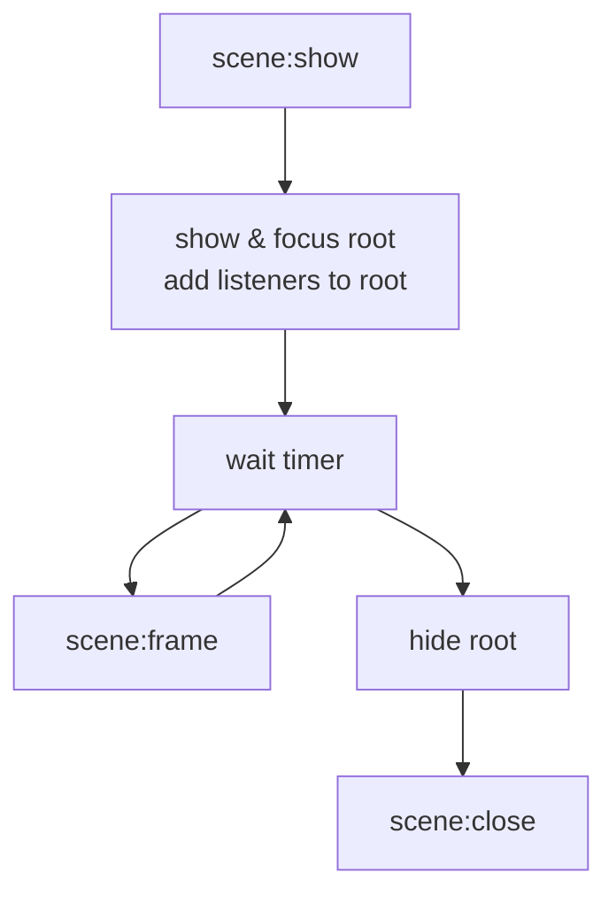

# PsyTask


JavaScript Framework for Psychology tasks.
Make psychology task development like making PPTs.
Compatible with the [jsPsych](https://github.com/jspsych/jsPsych) plugins.

Compared to jsPsych, PsyTask has:

- Easier and more flexible development experiment.
- Higher time precision.
- Smaller bundle size, Faster loading speed.

**[API Docs](https://bluebonesx.github.io/psytask)** or **[Play it now ! 🥳](https://bluebonesx.github.io/psytask/play)**

## Install

via NPM:

```bash
npm create psytask # create a project
```

```bash
npm i psytask # only install
```

via CDN:

```html
<!-- add required packages  -->
<script type="importmap">
  {
    "imports": {
      "psytask": "https://cdn.jsdelivr.net/npm/psytask@1/dist/index.min.js",
      "@psytask/core": "https://cdn.jsdelivr.net/npm/@psytask/core@1/dist/index.min.js",
      "@psytask/components": "https://cdn.jsdelivr.net/npm/@psytask/components@1/dist/index.min.js",
      "vanjs-core": "https://cdn.jsdelivr.net/npm/vanjs-core@1.6",
      "vanjs-ext": "https://cdn.jsdelivr.net/npm/vanjs-ext@0.6"
    }
  }
</script>
<!-- load packages -->
<script type="module">
  import { createApp } from 'psytask';

  using app = await creaeApp();
</script>
```

> [!WARNING]
> PsyTask uses the modern JavaScript [`using` keyword](https://developer.mozilla.org/docs/Web/JavaScript/Reference/Statements/using) for automatic resource cleanup.
>
> For CDN usage in old browsers that don't support the `using` keyword, you will see `Uncaught SyntaxError: Unexpected identifier 'app'`. You need to change the code:
>
> ```js
> // Instead of: using app = await createApp();
> const app = await createApp();
> // ... your code ...
> app.emit('dispose'); // Manually clean up when done
> ```
>
> Or, you can use the bundlers (like Vite, Bun, etc.) to transpile it.

## Usage

The psychology tasks are just like PPTs, they both have a series of scenes.
So writing a psychology task only requires 2 steps:

1. create scene
2. show scene

### Create Scene

```js
import { Container } from '@psytask/components';

using simpleText = app.scene(
  // scene setup
  Container,
  // scene options
  {
    defaultProps: { content: '' }, // props is show params
    duration: 1e3, // show 1000ms
    close_on: 'key: ', // close on space key
  },
);
```

Most of the time, you need to write the scene yourself, see [setup scene](#setup-scene):

```js
using scene = app.scene(
  /** @param {{ text: string }} props */
  (props, ctx) => {
    /** @type {{ response_key: string; response_time: number }} */
    let data;
    const node = document.createElement('div');

    ctx
      .on('scene:show', (newProps) => {
        // Reset data when the scene shows
        data = { response_key: '', response_time: 0 };
        // update DOM
        node.textContent = newProps.text;
      })
      // Capture keyboard responses
      .on('key:f', (e) => {
        data = { response_key: e.key, response_time: e.timeStamp };
        ctx.close(); // close scene when key f was pressed
      })
      .on('key:j', (e) => {
        data = { response_key: e.key, response_time: e.timeStamp };
        ctx.close();
      });

    // Return the element and data getter
    return {
      // use other Component
      node: Container({ content: node }, ctx),
      // data getter
      data: () => data,
    };
  },
  {
    defaultProps: { text: '' }, // same with setup params
    duration: 1e3,
    close_on: 'mouse:left',
  },
);
```

> [!TIP]
> use [JSDoc Comment](https://www.typescriptlang.org/docs/handbook/jsdoc-supported-types.html) to get type hint in JavaScript.

### Show Scene

```js
// show with parameters
const data = await scene.show({ text: 'Press F or J' });
// show with new scene options
const data = await scene.config({ duration: Math.random() * 1e3 }).show();
```

Usually, we need to show a block:

```js
import { RandomSampling, StairCase } from 'psytask';

// fixed sequence
for (const text of ['A', 'B', 'C']) {
  await scene.show({ text });
}

// random sequence
for (const text of RandomSampling({
  candidates: ['A', 'B', 'C'],
  sample: 10,
  replace: true,
})) {
  await scene.show({ text });
}

// staircase
const staircase = StairCase({
  start: 10,
  step: 1,
  up: 3,
  down: 1,
  reversals: 6,
  min: 1,
  max: 12,
  trial: 20,
});
for (const value of staircase) {
  const data = await scene.show({ text: value });
  const correct = data.response_key === 'f';
  staircase.response(correct); // set response
}
```

### Data Collection

```js
using dc = app.collector('data.csv');

for (const text of ['A', 'B', 'C']) {
  const data = await scene.show({ text });
  // add a row
  dc.add({
    text,
    response: data.response_key,
    rt: data.response_time - data.start_time,
    correct: data.response_key === 'f',
  });
}

dc.final(); // get final text
dc.download(); // download file
```

## Integration

### [jsPsych](https://www.jspsych.org)

Add packages:

```bash
npm i @psytask/jspsych @jspsych/plugin-cloze
npm i -d jspsych # for type hint
```

Or using CDN:

```html
<!-- load jspsych css-->
<link
  rel="stylesheet"
  href="https://cdn.jsdelivr.net/npm/jspsych@8.2.2/css/jspsych.css"
/>
<!-- add packages -->
<script type="importmap">
  {
    "imports": {
      ...
      "@psytask/jspsych": "https://cdn.jsdelivr.net/npm/@psytask/jspsych@1/dist/index.min.js",
      "@jspsych/plugin-cloze": "https://cdn.jsdelivr.net/npm/@jspsych/plugin-cloze@2.2.0/+esm"
    }
  }
</script>
```

> [!IMPORTANT]
> For CDNer, you should add the `+esm` after the jspsych plugin CDN URL, because jspsych plugins do not release ESM versions.

Then use it:

```js
import { jsPsychStim } from '@psytask/jspsych';
import Cloze from '@jspsych/plugin-cloze';

using jspsych = app.scene(jsPsychStim, { defaultProps: {} });
const data = await jspsych.show({
  type: Cloze,
  text: 'aba%%aba',
  check_answers: true,
});
```

### [JATOS](https://www.jatos.org/)

See [official docs](https://www.jatos.org/Submit-and-upload-data-to-the-server.html)

```html
<script src="jatos.js"></script>
```

```js
// wait for jatos loading
await new Promise((r) => jatos.onLoad(r));

using dc = app.collector().on('add', (row) => {
  // send data to JATOS server
  jatos.appendResultData(row);
});
```

## Learn more

So, how it works.

### Setup Scene

To create a scene, we need a setup function
that inputs **Props** and **Context**,
and outputs a object includes **Node** and **Data Getter**:

```js
const setup = (props, ctx) => ({
  node: '',
  data: () => ({}),
});
using scene = app.scene(setup);
```

- **Props** means show params that control the display of the scene.
- **Context** is the current scene itself,
  which is usually used to add [event](https://bluebonesx.github.io/psytask/types/_psytask_core.SceneEventMap.html) listeners.
- **Node** is the string or element which be mounted to the scene root element.
- **Data Getter** is used to get generated data for each show.

If you don't want to generate any data, just return **Node**:

```js
const setup = (props, ctx) => '';
```

> [!CAUTION]
> You shouldn't modify props, as it may change the default props.
>
> If you don't know whether you modify the default props, try to recursively [freeze](https://developer.mozilla.org/docs/Web/JavaScript/Reference/Global_Objects/Object/freeze) all its properties:
>
> ```js
> const recurFreeze =
>   /**
>    * @template {object} T
>    * @param {T} obj
>    * @returns {T}
>    */
>   (obj) => {
>     for (const v of Object.values(obj))
>       v != null && typeof v === 'object' && recurFreeze(v);
>     return Object.freeze(obj);
>   };
> const createProps =
>   /**
>    * @template {object} T
>    * @param {T} obj
>    * @returns {T}
>    */
>   (obj) => Object.create(recurFreeze(obj));
>
> using scene = app.scene(
>   /**
>    * @param {{
>    *   a: string;
>    *   b: number[];
>    *   c: { d: string[] };
>    * }} props
>    */
>   (props) => '',
>   {
>     defaultProps: createProps({
>       a: '',
>       b: [],
>       c: { d: [] },
>     }),
>   },
> );
> ```

### Update DOM

When you create a scene, the setup function will be called with the default **Props**, then the **Node** will be mounted. So if you want to update **Node** in each show, you should listen `scene:show` event:

```js
const setup = (props, ctx) => {
  const node = document.createElement('div');
  ctx.on('scene:show', (newProps) => {
    node.textContent = newProps.text;
  });
  return node;
};
```

Or, you can use [VanJS](https://vanjs.org) power via `adapter`, which provides [reactivity](#reactivity) update:

```js
import { adapter } from '@psytask/components';
import van from 'vanjs-core';

const { div } = van.tags;
const setup = adapter((props, ctx) => div(() => props.text));
```

### Show



### Reactivity

Stay tuned...
