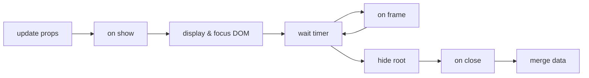
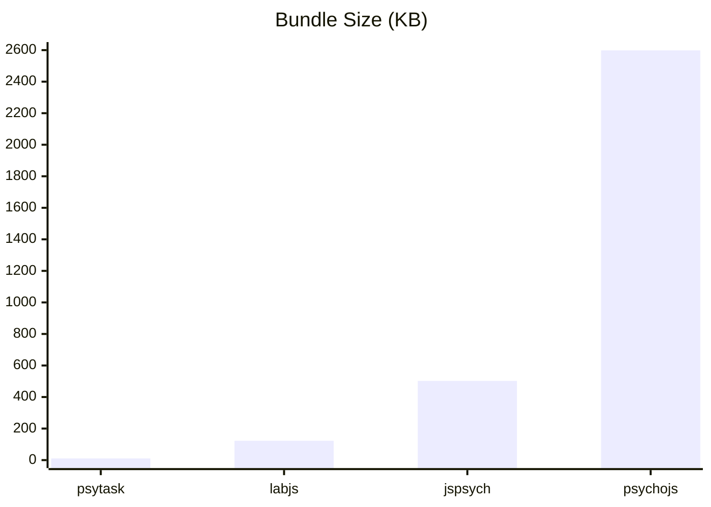

# PsyTask


JavaScript Framework for Psychology tasks.
Make development like making PPTs.

Compared to others, it:

- Easier and more flexible
- Higher time precision. see [benchmark](#benchmark)
- Smaller bundle size, Faster loading speed. see [benchmark](#benchmark)
- Type-Safe

[Integration](#integration) with:

- [jsPsych](https://github.com/jspsych/jsPsych) plugins.
- Data server: [JATOS]() ...
- UI framework: [Vue](https://vuejs.org), [Solid](https://docs.solidjs.com), [Lit](https://lit.dev), [Van](https://vanjs.org) ...
- Reactive framework: [Rxjs](https://rxjs.dev), [Mobx](https://mobx.js.org), [Valtio](https://valtio.dev) ...

**[API Docs](https://bluebonesx.github.io/psytask/) | [Benchmark](https://bluebonesx.github.io/psytask/benchmark/) | [Tests](https://bluebonesx.github.io/psytask/tests/) | [Play it now ! 🥳](https://bluebonesx.github.io/psytask/play/)**

## Install

via NPM:

```bash
npm create psytask # create a project
```

```bash
npm install psytask # only framework
npm install @psytask/component vanjs-core vanjs-ext # optional: use VanJS
```

via CDN:

```html
<!-- add required packages  -->
<script type="importmap">
  {
    "imports": {
      "psytask": "https://cdn.jsdelivr.net/npm/psytask@1/dist/index.min.js",
      "@psytask/core": "https://cdn.jsdelivr.net/npm/@psytask/core@1/dist/index.min.js",
      "@psytask/components": "https://cdn.jsdelivr.net/npm/@psytask/components@1/dist/index.min.js",
      "vanjs-core": "https://cdn.jsdelivr.net/npm/vanjs-core@1.6",
      "vanjs-ext": "https://cdn.jsdelivr.net/npm/vanjs-ext@0.6"
    }
  }
</script>
<!-- load packages -->
<script type="module">
  import { createApp } from 'psytask';

  using app = await creaeApp();
</script>
```

> [!WARNING]
> PsyTask uses the modern JavaScript [`using` keyword](https://developer.mozilla.org/docs/Web/JavaScript/Reference/Statements/using) for automatic resource cleanup.
>
> For CDN usage in old browsers that don't support the `using` keyword, you will see `Uncaught SyntaxError: Unexpected identifier 'app'`. You need to change the code:
>
> ```js
> // Instead of: using app = await createApp();
> const app = await createApp();
> // ... your code ...
> app.emit('dispose'); // Manually clean up when done
> ```
>
> Or, you can use the bundlers (like Vite, Bun, etc.) to transpile it.

## Usage

The psychology tasks are just like PPTs, they both have a series of scenes.
So writing a task only requires 2 steps: creating and showing scene.

### Create Scene

All you need is [Component](#component):

```js
import { Grating, adapter } from '@psytask/components';

using simpleText = app.scene(
  // component
  Grating,
  // scene options
  {
    adapter, // VanJS support
    defaultProps: { type: Math.sin, size: 100, sf: 0.02 }, // show params
    duration: 1e3, // show 1000 ms
    close_on: 'key: ', // close on space key
  },
);
```

### Show Scene

Override default props or options:

```js
const data = await scene.show({ text: 'Press F or J' }); // new props
const data = await scene.config({ duration: 1e3 }).show(); // new options
```

Block:

```js
import { RandomSampling, StairCase } from 'psytask';

// fixed sequence
for (const text of ['A', 'B', 'C']) {
  await scene.show({ text });
}

// random sequence
for (const text of RandomSampling({
  candidates: ['A', 'B', 'C'],
  sample: 10,
  replace: true,
})) {
  await scene.show({ text });
}

// staircase
const staircase = StairCase({
  start: 10,
  step: 1,
  up: 3,
  down: 1,
  reversals: 6,
  min: 1,
  max: 12,
  trial: 20,
});
for (const value of staircase) {
  const data = await scene.show({ text: value });
  const correct = data.response_key === 'f';
  staircase.response(correct); // set response
}
```

### Data Collection

```js
using dc = app.collector('data.csv');

for (const text of ['A', 'B', 'C']) {
  const data = await scene.show({ text });

  // `frame_times` will be recorded automatically
  const start_time = /** @type {number} */ (data.frame_times[0]);

  // add a row
  dc.add({
    text,
    response: data.response_key,
    rt: data.response_time - start_time,
    correct: data.response_key === 'f',
  });
}

dc.final(); // file content
dc.download(); // download file
```

## Learn more

### Component

It a function
that inputs **Props** and outputs a object includes **Node** and **Data Getter**:

- **Props** means show params that control the display of the scene.
- **Node** is the string or element or array, which be mounted to the scene root element.
- **Data Getter** is used to get generated data.

```js
const Component = (props) => {
  const ctx = getCurrentScene();
  return { node: '', data: () => ({}) };
};
const Component = (props) => 'text node';
const Component = (props) => document.createElement('div');
const Component = (props) => ['text node', document.createElement('div')];
```

> [!CAUTION]
> You shouldn't modify props whatever, as it may change the default props.
> See one-way data flow in [Redux](https://redux.js.org/tutorials/fundamentals/part-2-concepts-data-flow) and [Vue](https://vuejs.org/guide/components/props.html#one-way-data-flow).

A practical example:

```js
import { on, getCurrentScene } from 'psytask';
import { ImageStim, adapter } from '@psytask/components';
import van from 'vanjs-core';

const { div } = van.tags;
const Component =
  /** @param {{ text: string }} props */
  (props) => {
    /** @type {{ response_key: string; response_time: number }} */
    let data;
    const ctx = getCurrentScene();

    // add DOM event listener
    const cleanup = on(ctx.root, 'keydown', (e) => {
      if (e.key !== 'f' || e.key !== 'j') return;
      data = { response_key: e.key, response_time: e.timeStamp };
      ctx.close(); // close on 'f' or 'j'
    });

    ctx
      // reset data on show
      .on('show', () => {
        data = { response_key: '', response_time: 0 };
      })
      // remove DOM event listenr on dispose
      .on('dispose', cleanup);

    // Return the element and data getter
    return {
      node: div(
        // use other Component
        ImageStim({ image: new ImageData(1) }),
      ),
      data: () => data,
    };
  };
```

> [!TIP]
> use [JSDoc Comment](https://www.typescriptlang.org/docs/handbook/jsdoc-supported-types.html) to get type hint in JavaScript.

### Setup

When you call `app.scene(Component, { adapter, defaultProps })`,
it will use `adapter.render` to call `Component` with `defaultProps` once,
then **Node** will be mount to `this.root`.

> [!NOTE]
> the component will be called only once, the following DOM update will be triggered by **Props** update. See [reactivity](#reactivity).

### Show

When you call `await scene.show(patchProps)`, it will excute the following process:

- Update props: merge patch props with default props to update current props, which will trigger [reactivity](#reactivity) update.
- Listeners added by `this.on('show')` will be called.
- Display and focus `this.root`, it will be displayed on the screen _in the next frame_.
- Create timer by `this.options.timer` and wait it to stop.
- Listeners added by `this.on('frame')` will be called when timer is running.
- Hide `this.root` when timer is stoped, it will be hidden on the screen _in the next frame_.
- Listeners added by `this.on('close')` will be called.
- Merge the timer records and the data from **Data Getter**.



### Reactivity

Stay tuned...

Better to see: [VanJS tutorial](https://vanjs.org/tutorial), [Vue reactivity](https://vuejs.org/guide/extras/reactivity-in-depth.html)

## [Benchmark](https://bluebonesx.github.io/psytask/benchmark/)

The bunlde size of PsyTask is 1/12 of labjs, 1/50 of jspsych, and 1/260 of psychojs.



## Integration

### [jsPsych](https://www.jspsych.org/plugins/list-of-plugins/)

```bash
npm i @psytask/jspsych @jspsych/plugin-cloze
npm i -d jspsych # optional: for type hint
```

Or using CDN:

```html
<!-- load jspsych css-->
<link
  rel="stylesheet"
  href="https://cdn.jsdelivr.net/npm/jspsych@8.2.2/css/jspsych.css"
/>
<!-- add packages -->
<script type="importmap">
  {
    "imports": {
      ...
      "@psytask/jspsych": "https://cdn.jsdelivr.net/npm/@psytask/jspsych@1/dist/index.min.js",
      "@jspsych/plugin-cloze": "https://cdn.jsdelivr.net/npm/@jspsych/plugin-cloze@2.2.0/+esm"
    }
  }
</script>
```

> [!IMPORTANT]
> For CDNer, you should add the `+esm` after the jspsych plugin CDN URL, because jspsych plugins do not release ESM versions. Or you can use [esm.sh](https://esm.sh).

```js
import { jsPsychStim } from '@psytask/jspsych';
import Cloze from '@jspsych/plugin-cloze';

using jspsych = app.scene(jsPsychStim, {
  defaultProps: {
    type: Cloze,
    text: 'aba%%aba',
    check_answers: true,
  },
});
const data = await jspsych.show();
```

### [JATOS](https://www.jatos.org/Submit-and-upload-data-to-the-server.html)

```html
<!-- add jatos script -->
<script src="jatos.js"></script>
```

```js
// wait for jatos loading
await new Promise((r) => jatos.onLoad(r));

using dc = app.collector().on('add', (row) => {
  // send data to JATOS server
  jatos.appendResultData(row);
});
```
